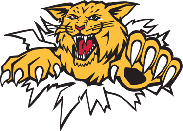
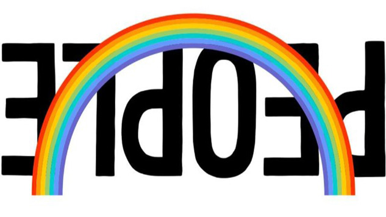

## Mise en contexte

Une composante importante de la communauté est rattachée aux projets qui sont travaillés par les membres de la communauté. Les projets concrets permettent de mettre en application des notions étudiées, de développer différents talents et aussi d'avoir un impact concret dans la vie de certaines personnes.

---

## Projet 1: Listes de repêchage

**Idées:**

- Créer une *master* list à partir de différentes listes de scouting.

 
 

---

## Projet 2: PEOPLE

**Idées:**

- Network of collaborative distances.
- Neural network: Music to images.

---
class: center, middle

## Autres idées ?